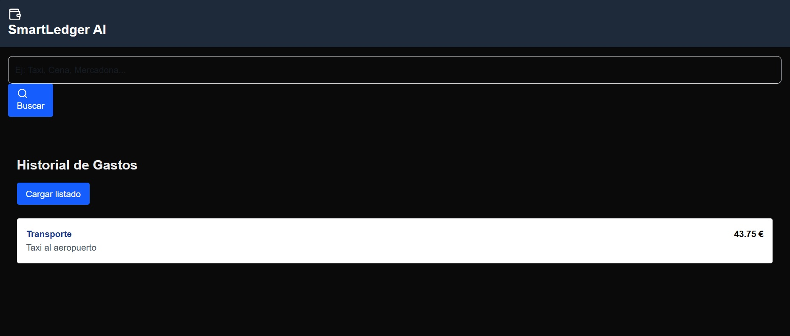

## SmartLedger AI

# 🏦 SmartLedger AI - Tu Asistente Financiero Inteligente


**SmartLedger AI** es una aplicación Full Stack de gestión financiera que utiliza **Inteligencia Artificial Generativa** para simplificar el registro de gastos. Olvídate de los formularios tediosos: simplemente describe tu gasto en lenguaje natural y el sistema lo categoriza, extrae el importe y lo registra automáticamente.

---

## 🚀 Características Principales

* 🤖 **Clasificación Automática con IA:** Integración con **Google Gemini 1.5 Flash** para analizar descripciones de texto libre (ej: *"Cena con amigos 30€"*) y convertirlas en datos estructurados JSON.
* ☕ **Backend Moderno y Robusto:** Construido con **Java 25** y **Spring Boot 4**, siguiendo principios de arquitectura limpia (Controller-Service-Repository).
* ⚛️ **Frontend Reactivo:** Interfaz de usuario moderna y rápida desarrollada con **Next.js** y **Tailwind CSS**.
* 💾 **Persistencia de Datos:** Base de datos SQL (H2 en memoria para desarrollo, extensible a PostgreSQL).
* 🛡️ **Seguridad y Calidad:** Uso de validaciones, manejo de errores robusto y configuración segura de API Keys.

---

## 🛠️ Stack Tecnológico

### Backend (API REST)
* **Lenguaje:** Java 25 (Preview Features)
* **Framework:** Spring Boot 4.0.0
* **Base de Datos:** H2 Database / Spring Data JPA
* **AI Integration:** Google Gemini API (Model: `gemini-2.5-flash`)

### Frontend (Web App)
* **Framework:** Next.js 16.0.8 (App Router)
* **Librería UI:** React
* **Estilos:** Tailwind CSS
* **Iconos:** Lucide React

---

## 📸 Capturas de Pantalla




---

## 🔧 Instalación y Ejecución

Sigue estos pasos para probar el proyecto en tu máquina local.

### Prerrequisitos
* Java JDK 21 o superior (Recomendado Java 25)
* Node.js 18+
* Una API Key de Google Gemini (Gratis en Google AI Studio)

### 1. Configurar el Backend
1.  Clona el repositorio:
    ```bash
    git clone [https://github.com/TU_USUARIO/SmartLedger-AI.git](https://github.com/TU_USUARIO/SmartLedger-AI.git)
    cd SmartLedger-AI/backend
    ```
2.  Crea un archivo `.env` en la carpeta `backend` y añade tu clave:
    ```properties
    GOOGLE_API_KEY=tu_clave_secreta_aqui
    ```
3.  Ejecuta el servidor:
    ```bash
    ./mvnw spring-boot:run
    ```

### 2. Configurar el Frontend
1.  Abre una nueva terminal y ve a la carpeta frontend:
    ```bash
    cd ../frontend
    ```
2.  Instala las dependencias:
    ```bash
    npm install
    ```
3.  Inicia la aplicación web:
    ```bash
    npm run dev
    ```
4.  Abre tu navegador en `http://localhost:3000`.

---

## 🧠 ¿Cómo funciona la IA?

El núcleo del proyecto reside en `GastoService.java`. El flujo es el siguiente:

1.  El usuario envía un texto crudo desde el Frontend (ej: *"Taxi 15 euros"*).
2.  Spring Boot recibe la petición y construye un **Prompt optimizado**.
3.  Se envía la solicitud a la API de **Google Gemini 1.5 Flash** mediante `HttpClient`.
4.  La IA responde con un JSON limpio que incluye categoría inferida (`Transporte`), importe normalizado (`15.00`) y descripción.
5.  El sistema deserializa la respuesta, la guarda en la base de datos y la devuelve al usuario en milisegundos.

---

## 👤 Autor

**Virginia Toledo Gavagnin**
*Desarrolladora Full Stack & RPA Developer*

[LinkedIn](https://www.linkedin.com/in/virginia-toledo-gavagnin/) | [GitHub](https://github.com/VirginiaXiao148)
